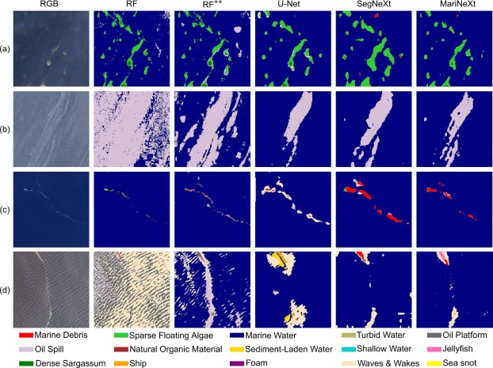

To detect marine pollutant from Conpernicus Sentinel-2 Imagery, we plan to replicate the success from the white paper: [`Detecting Marine pollutants and Sea Surface features with Deep learning in Sentinel-2 imagery`](https://www.sciencedirect.com/science/article/pii/S0924271624000625) published in ISPRS Journal of Photogrammetry and Remote Sensing, 2024. This paper addresses the challenges in detecting marine pollutants (like oil spills and marine debris) using Sentinel-2 satellite imagery. It introduces a new dataset, MADOS, containing diverse global annotations and proposes a novel deep learning model, MariNeXt, optimized for semantic segmentation in marine environments which in the context of this hackthon can help us in **hazard detection**.

## Results

## The RGB images show: 
a) Dense & sparse Sargassum, Marine Water and haze/thin clouds, 

b) Oil Spill and Marine Water, 

c) Marine Debris and Marine Water, and 

d) Jellyfish and rough sea state. The RGB images were stretched for illustration purposes. For more classification results, the reader is referred to Supplementary

## The concept

**Data Source**: `MADOS Dataset` with the following characteristics:
- Contains 15 thematic classes, including Marine Debris, Oil Spill, Ships, and Sargassum.
- Comprises 174 globally distributed Sentinel-2 scenes with ~1.5 million annotated pixels.
- Data collected under diverse weather and sea conditions.

**The model architecture**: `MariNeXt Model`
Built on **SegNeXt** architecture, improved for high-resolution and multispectral data.
Incorporates unique features:
- 1st-Stage Higher Resolution Features: Retains finer details essential for marine debris detection.
- Very Simple Copy-Paste (VSCP): Data augmentation technique to enrich sparse annotations.
- Test-Time Augmentation (TTA): Enhances prediction accuracy through multiple image transformations during inference.

**The model performance**:
Outperforms baseline models (U-Net, Random Forest, SegNeXt) by at least 12% in F1 and mIoU metrics.
Achieves **76.0%** F1 and **64.3%** mIoU on the test set.

### We can reuse the code available on [github](https://github.com/gkakogeorgiou/mados)