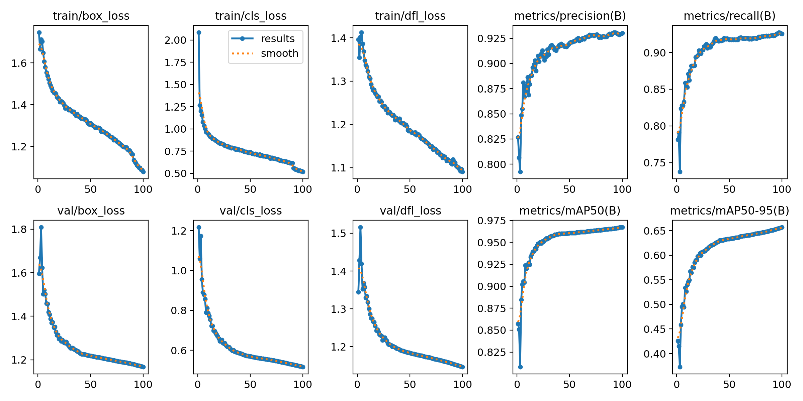
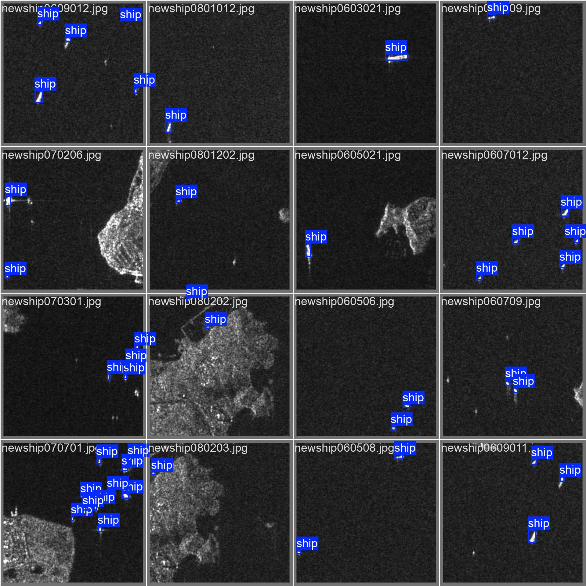
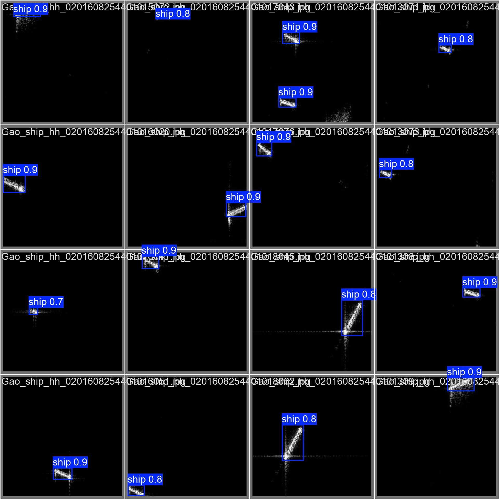
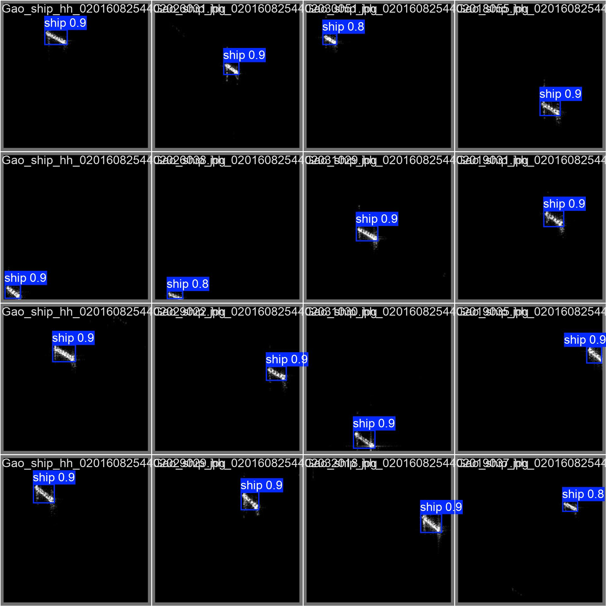

### Results

### Explanation of Results

1. **Loss (Error) During Training and Validation**  
   Loss measures how well the model is learning during training and how it performs on unseen validation data. Lower loss values mean the model is making fewer errors.

2. **Metrics to Evaluate Model Performance**  
   Metrics like **Precision**, **Recall**, and **mAP (Mean Average Precision)** tell us how good the model is at detecting objects correctly.

   
#### Observations from the Plot:
1. Both training and validation losses decrease over epochs, indicating the model is learning and improving.
2. The validation losses remain close to the training losses, showing that the model is generalizing well without overfitting.

### Examples
#### Labeled data

#### Predicted data

#### Labeled data

#### Predicted data

#### Labeled data

#### Predicted data
