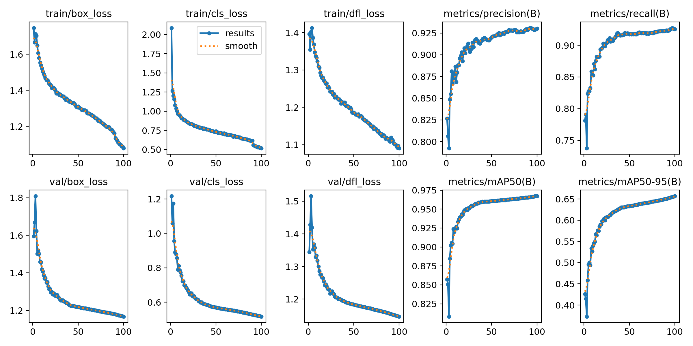
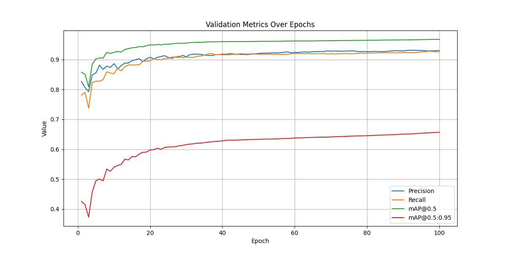
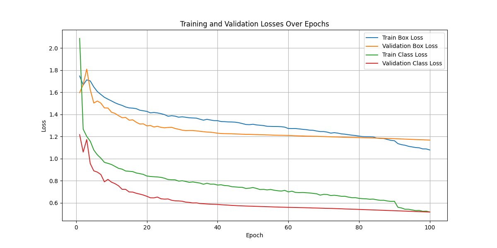
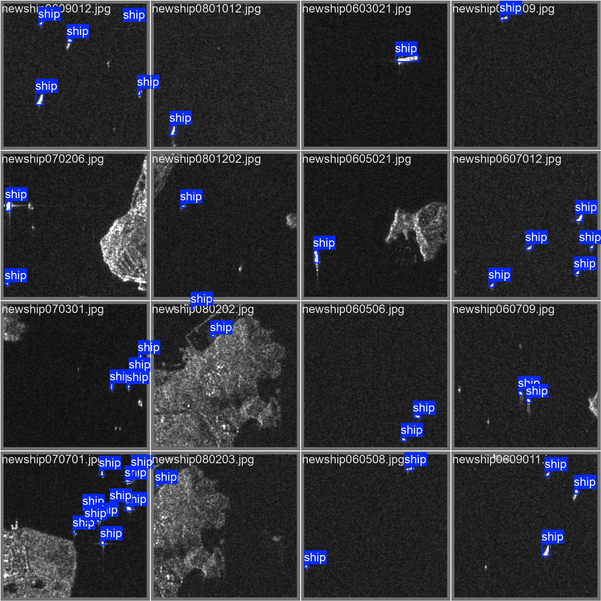
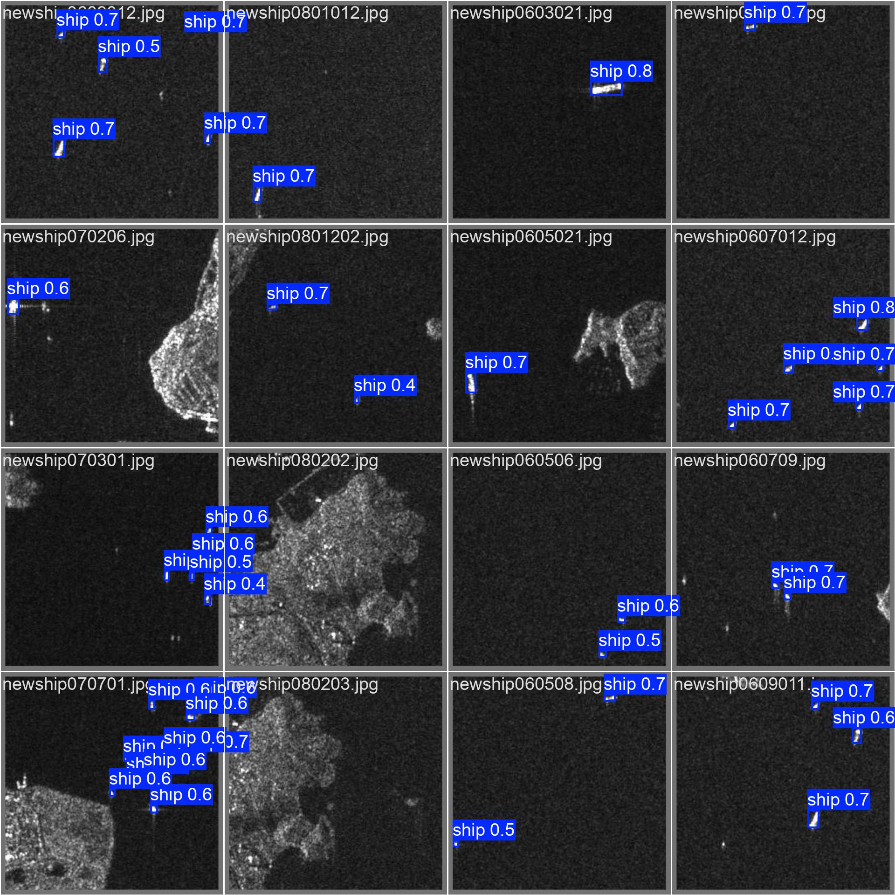
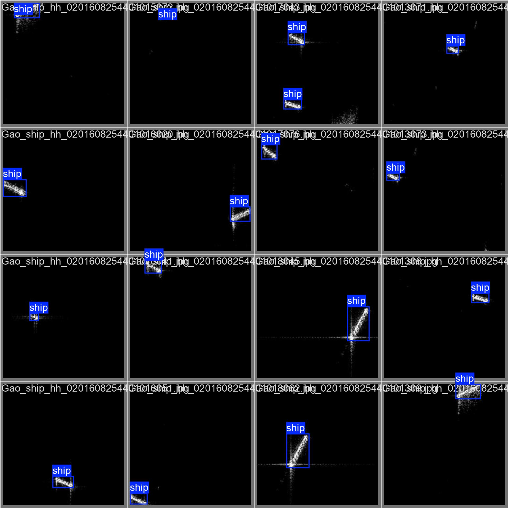
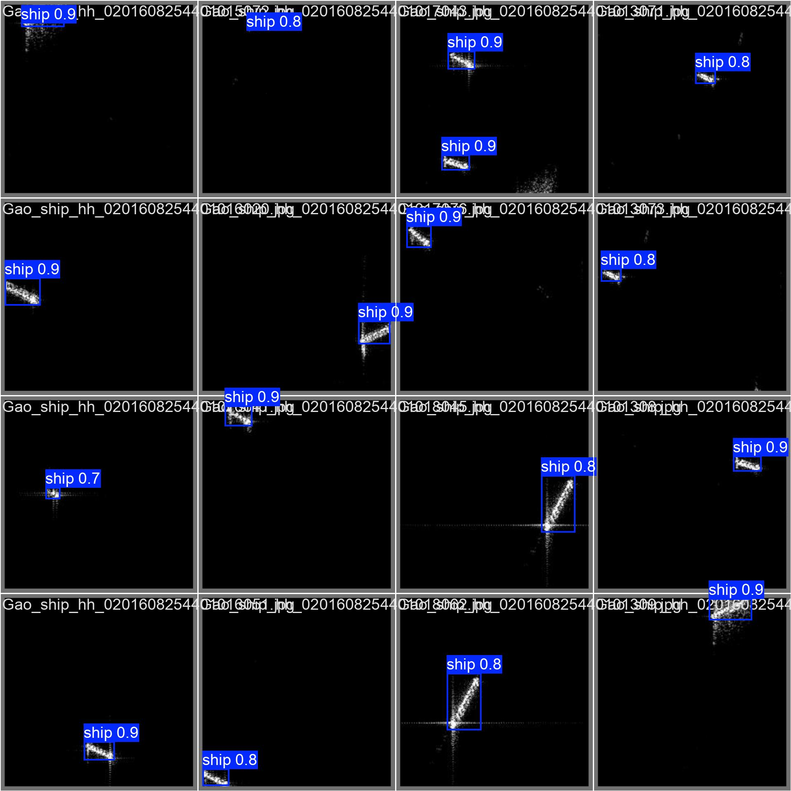
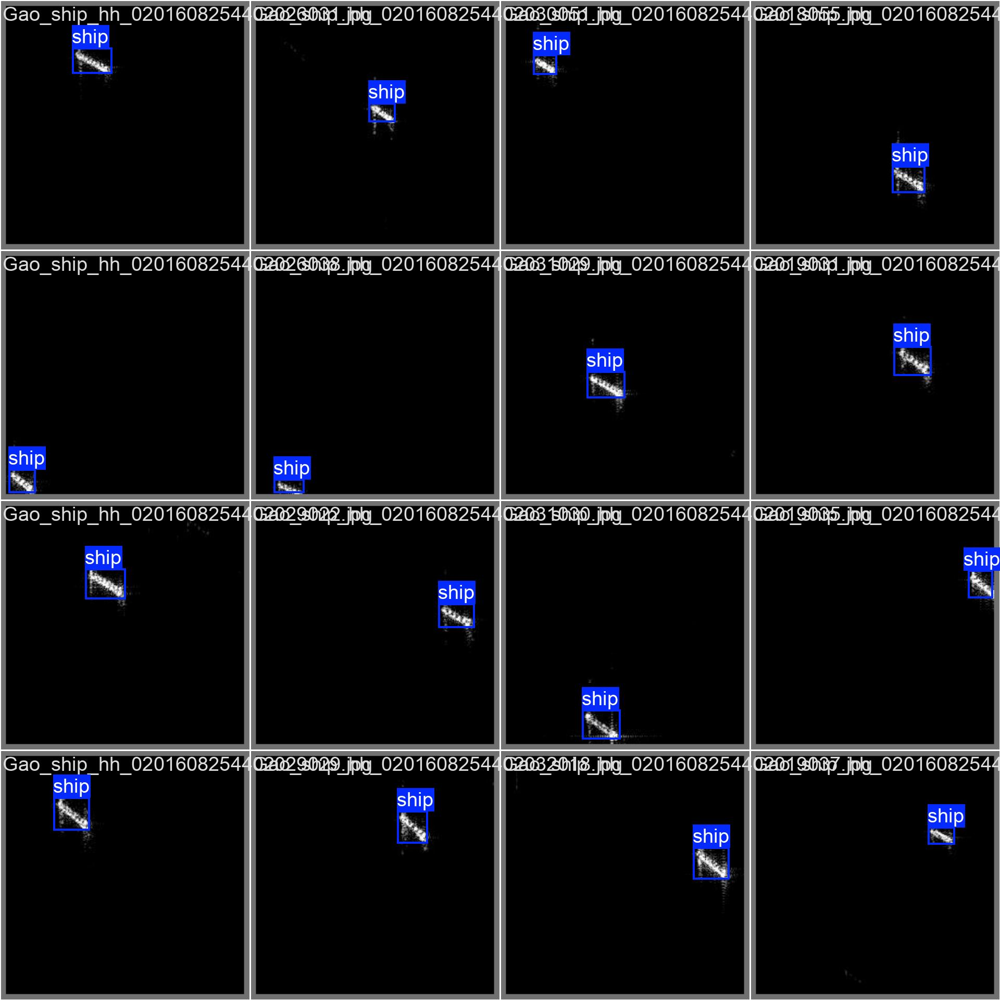
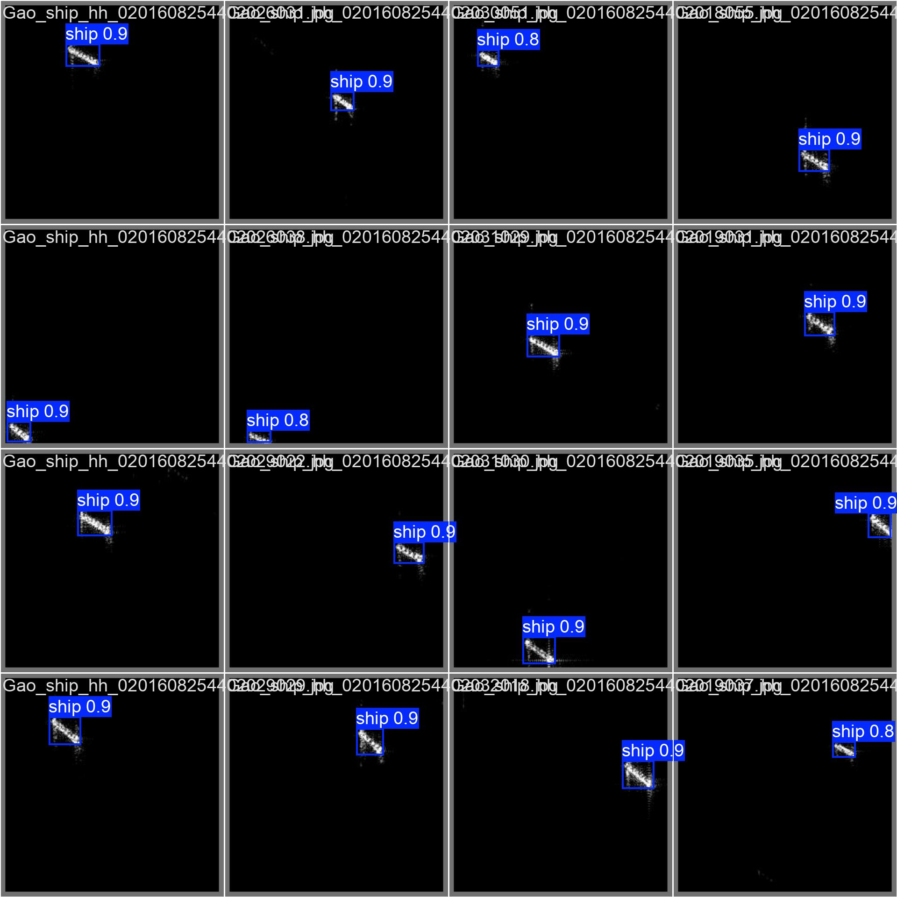

### Results

### Explanation of Results

1. **Loss (Error) During Training and Validation**  
   Loss measures how well the model is learning during training and how it performs on unseen validation data. Lower loss values mean the model is making fewer errors.

2. **Metrics to Evaluate Model Performance**  
   Metrics like **Precision**, **Recall**, and **mAP (Mean Average Precision)** tell us how good the model is at detecting objects correctly.

#### Training and Validation Losses:
1. **Blue Line (Train Box Loss):**  
   This tracks how well the model is learning to place bounding boxes around objects during training.

2. **Orange Line (Validation Box Loss):**  
   This shows how well the model is placing bounding boxes on unseen validation data. Ideally, this should be close to the training loss.

3. **Green Line (Train Class Loss):**  
   This measures the model’s accuracy in classifying detected objects during training.

4. **Red Line (Validation Class Loss):**  
   Similar to training classification loss but for unseen validation data.

#### Metrics:
1. **Precision (`93%`):**  
   Out of all the objects the model detected, 93% were correct.

2. **Recall (`92.54%`):**  
   The model successfully detected 81.75% of the actual objects present.

3. **mAP@0.5 (`96.7%`):**  
   At a moderate overlap between predicted and actual bounding boxes, the model’s performance is excellent.

4. **mAP@0.5:0.95 (`65.68%`):**  
   At stricter overlap thresholds, the model’s performance drops, which is common for complex tasks.

   
#### Observations from the Plot:
1. Both training and validation losses decrease over epochs, indicating the model is learning and improving.
2. The validation losses remain close to the training losses, showing that the model is generalizing well without overfitting.

### Examples
#### Labeled data

#### Predicted data

#### Labeled data

#### Predicted data

#### Labeled data

#### Predicted data

